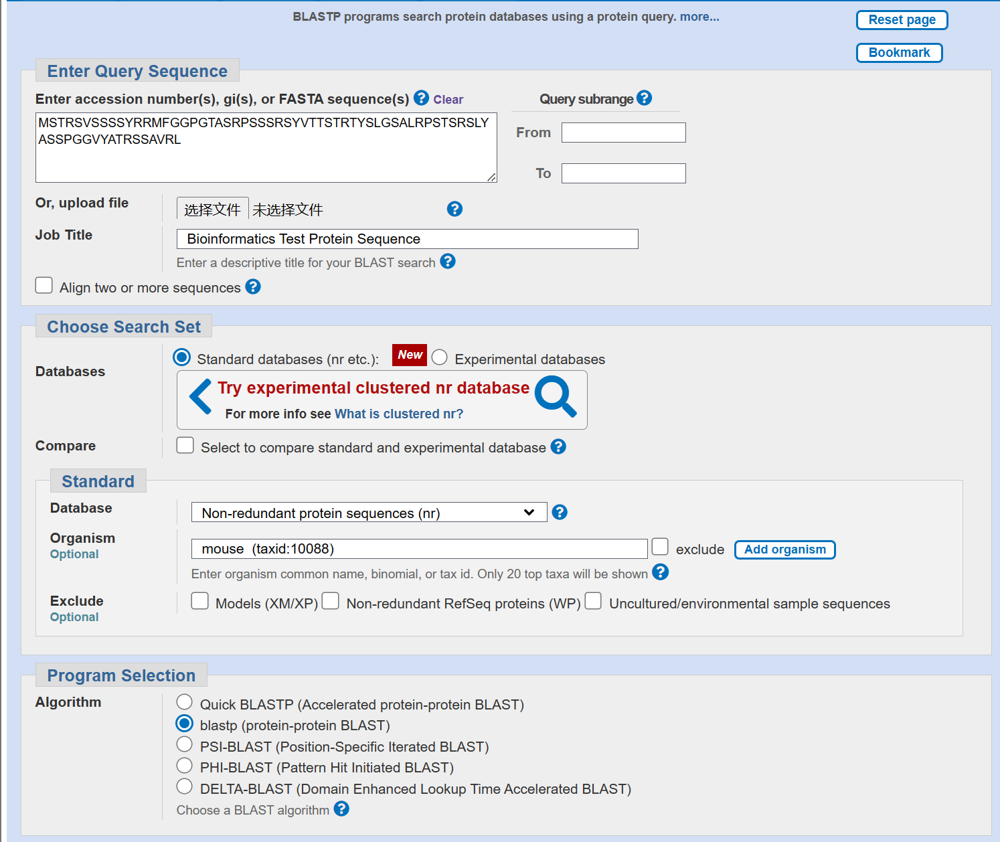
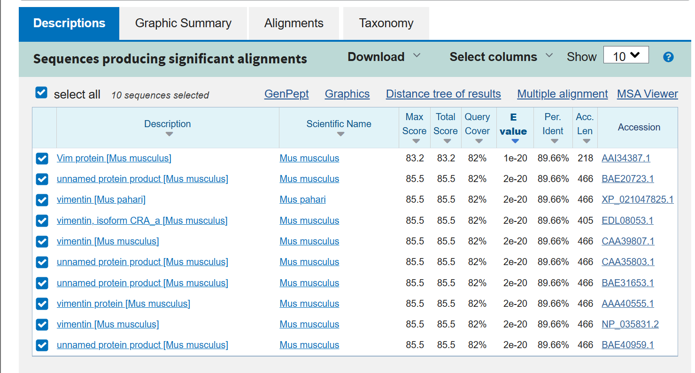

# BLAST
## Task 1
* 参数设置


* 结果显示

* E Value
E值是在一次数据库搜索中随机条件下期望发生的得分大于或等于当前对比得分的序列数目，较大的E-value表明查询的序列相似性可能是随机的，而小的E-value表示序列相似性可能是因为同源（或潜在的趋同进化）
* P Value
P值表示随机条件下出现序列得分高于当前对比得分的序列的可能性，P值乘以搜索空间（数据库大小）得到的即为E值

## Task 2
* 准备工作
```shell
mkdir HW
cd HW
touch shuffle.sh
chmod u+x shuffle.sh
touch blast.sh
chmod u+x blast.sh
```
* 打乱序列的脚本实现`shuffle.sh`
```shell
#!/bin/bash
seq="MSTRSVSSSSYRRMFGGPGTASRPSSSRSYVTTSTRTYSLGSALRPSTSRSLYASSPGGVYATRSSAVRL"
var=1
bg=0
L=${#seq}
ed=$(($L-1))
shuffled=""
while [ "$var" -le "10" ]   # 生成10个文件
do
for i in `seq $bg $ed | shuf `;do
    shuffled=$shuffled${seq:$i:1}   # 乱序
done
echo $shuffled > seq$var.txt    # 输出到指定文件
shuffled="" # 一次循环后初始化shuffled
((var++))
done
```
* 10个乱序文件的BLAST脚本`blast.sh`
```shell
#!/bin/bash
var1=1  # query的序列
var2=2  # subject的序列
while [ "$var1" -le "9" ]
do
while [ "$var2" -le "10" ]
do
blastp -query seq$var1.txt -subject seq$var2.txt -out output/seq$var1-$var2.blastp
((var2++))
done
((var1++))
var2=$(($var1+1))
done
```
* 最终结果
```shell
blast.sh*  output/  ref-test.blastp  ref.txt  seq10.txt  seq1.txt  seq2.txt  seq3.txt  seq4.txt  seq5.txt  seq6.txt  seq7.txt  seq8.txt  seq9.txt  shuffle.sh*  test.txt
```
* output文件夹的结果
```shell
seq1-10.blastp  seq1-5.blastp  seq1-9.blastp   seq2-5.blastp  seq2-9.blastp   seq3-6.blastp  seq4-10.blastp  seq4-8.blastp   seq5-7.blastp   seq6-7.blastp   seq7-8.blastp   seq9-10.blastp
seq1-2.blastp   seq1-6.blastp  seq2-10.blastp  seq2-6.blastp  seq3-10.blastp  seq3-7.blastp  seq4-5.blastp   seq4-9.blastp   seq5-8.blastp   seq6-8.blastp   seq7-9.blastp
seq1-3.blastp   seq1-7.blastp  seq2-3.blastp   seq2-7.blastp  seq3-4.blastp   seq3-8.blastp  seq4-6.blastp   seq5-10.blastp  seq5-9.blastp   seq6-9.blastp   seq8-10.blastp
seq1-4.blastp   seq1-8.blastp  seq2-4.blastp   seq2-8.blastp  seq3-5.blastp   seq3-9.blastp  seq4-7.blastp   seq5-6.blastp   seq6-10.blastp  seq7-10.blastp  seq8-9.blastp
```
* 乱序文件的结果
```shell
cat seq*.txt
YRASRLMASYSTTSAGTSYGSSGSGSSTTPSYSVPVRLSSSRRVYRRTTFPSSMSGTRSLSLGRAPRSVA
SSPSGTSARVMMYATVTSRSSRLTAYSFGYSRLSSVRGGPSSLAVSRTRTSSLYSASSRTPGSRYGRTPS
GTSVSSASRSAYRYPPGASSSLRVYSSSSAATLRSRPSVVMSRGGSYFRLYSRSPTLTTTGMTTSSRGSR
YSLPSYGSVPTSRAVLTSFYSGSVRSSGSSLMYSRSSRSSAGSSTMPGARSGRRSTTRATRTVTAPSRYL
SRSSSRYSTSSSLYSGYSFLLVSTSPSRVMARLRSSSTARGMYVSRVPSGPGRRATYTGATGRSPTASTS
SRRGTYRPYTSVSASTLRGGSRSAPGSSATMRASRMSVPLLTRGSSSSAVYVYTSPSSSTYLTSGSRFSR
YTSGYRSVPASSSARLMSSRATTSASPGSSRSSSRSSTRRYTMSLRYSLRTVLFVGGASTGYPTSVSPGR
TSSSPRVAGSYPARYTSMYRRGVSVYYASSTMLALGPSSSTSSSALVFSTRTGTTGRRRSGSSSLRRPSS
SYPTVAPSSSTSSTAPRARRVRRSLLTASYRSYGSYSLVTSSGMTRSYSGSRSSLSGSRFRSPTMVGATG
RAMFSSSGYRSVSRSTRAASYGLGRSPPSLAPTVTRPRTVSYSRGSRTMSSAYSLVTRLSTGGSYSSSTS
```
* 结果分析
在output文件夹的结果之外，我还以ref.txt与test.txt文件进行了blast，其中ref.txt存储有原序列，test.txt是仅改变第二位氨基酸的序列。比对结果在ref-test.blastp中。分析其结果发现，对应E-value为1e-43，说明他们的匹配程度极高，这与事实相符。
而在seq1-10.blastp文件中，两序列的hit极短，对应E-value也为0.64，这说明两者基本不同源，与随机结果一致

## Task 3
BLAST算法在使用动态规划的基础上，考虑局部最优算法，将序列拆分成了多个小片段进行计算，再将这些小片段延申链接起来，能加快整体运算速度，迅速找到数据库中的相似序列。
与此同时，由于数据库服务端本身也在进行运算，所以通过hash表索引能很快的将对应序列找到。

## Task 4
非对称PAM矩阵更一般的代表PAM Mutation Probability Matrix，其分数的分布能够反应两部分信息:
1. 每个氨基酸分子结构的稳定性。以Cysteine为例，C能够在蛋白内形成二硫键，其键位结构稳定性对蛋白构象有重要影响，因此不容易突变为其他氨基酸，也对应了非对称PAM矩阵中的C-C对角值的高分数。
2. 每个氨基酸分子的突变趋向和分子结构相似性。由非对称PAM分数，Alanine保持为Alanine和突变为Glycine的概率是接近的，两者的结构也仅仅只相差一个甲基。
 
对称PAM矩阵实现了三个优化：
1. 对每个突变概率进行了生物学意义上的normalization
2. 因为矩阵对称，只需要考虑半个矩阵的分数
3. 对蛋白序列每个位点的打分只需要简单相加对称矩阵中的分数

目前使用PAM矩阵的领域有：
1. 确定发育树中的分化时间（非对称）
2. 在BLAST等序列比对算法中用作打分矩阵（对称）