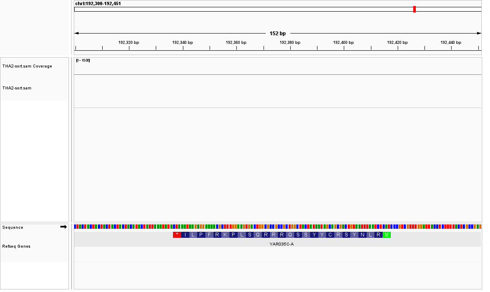

# Mapping
## Task 1
* BWT算法得到的BWM矩阵中第一列（原序列）的信息可以被最后一列完全存储，通过一一映射的关系（decode）就能从最后一列还原原序列的信息，这大大提高了运算的速度，时间复杂度为O(m)
* 由于转换后大量相同的字符排列在一起，所以压缩后能大大减少内存占用
* 通过存储字符出现的次数和设置检查点，可以解决了扫描字符速度过慢，存储需要消耗过大的存储的问题
## Task 2
```shell
bowtie -v 2 -m 10 --best --strata BowtieIndex/YeastGenome -f THA2.fa -S THA2.sam
grep -v @ THA2.sam | awk -F '\t' '{print $3}' | sort | uniq -c
# 输出结果如下
     92 *
     18 chrI
     51 chrII
     15 chrIII
    194 chrIV
     25 chrIX
     12 chrmt
     33 chrV
     17 chrVI
    125 chrVII
     68 chrVIII
     71 chrX
     56 chrXI
    169 chrXII
     67 chrXIII
     58 chrXIV
    101 chrXV
     78 chrXVI
```
## Task 3
### Task 3.1
* CIGAR = Concise Idiosyncratic Gapped Alignment Report
* 它是对比对信息的描述，具体参数如下

* 例如"56M1I30"，表示前56bp能够match上，中间有1bp的insertion（相比于参考基因组有1bp的插入），最后是30bp的match
### Task 3.2
* Soft Clip是指虽然比对不到基因组，但是还是存在于SEQ (segment SEQuence)中的序列，此时CIGAR列对应的是S(Soft)的符号
### Task 3.3
* MAPQ（Mapping Qualities）用来表示每条read的比对情况，MAPQ越高，表示比对质量越好，说明该read比对到参考基因组上的位置越唯一
### Task 3.4
* 可以，如ref中提到的，将MDtag，CIGAR和SEQ结合，可以重新构造已映射到的参考序列的碱基序列

## Task 4
* 软件下载
```shell
git clone https://github.com/lh3/bwa.git
cd bwa-master
make
```
* 文件获取
```shell
wget https://hgdownload.soe.ucsc.edu/goldenPath/sacCer3/bigZips/sacCer3.fa.gz
gunzip sacCer3.fa.gz
```
* 命令执行
```shell
bwa index sacCer3.fa
bwa aln sacCer3.fa THA2.fa > THA2-bwa.sai
bwa samse sacCer3.fa THA2-bwa.sai THA2.fa > THA2-bwa.sam
grep -v @ THA2-bwa.sam | awk -F '\t' '{print $3}' | sort | uniq -c
# 输出结果如下
     24 *
     17 chrI
     54 chrII
     17 chrIII
    202 chrIV
     26 chrIX
     18 chrM
     38 chrV
     18 chrVI
    129 chrVII
     70 chrVIII
     77 chrX
     60 chrXI
    178 chrXII
     72 chrXIII
     59 chrXIV
    108 chrXV
     83 chrXVI
```
得到的文件见`BwaRef`文件夹
另外，此处若使用以下命令：
```shell
bwa mem sacCer3.fa THA2.fa > THA2-bwa.sam
```
效果比较差，原因可能是MEM比对作为局部比对算法更适合long reads，而给定文件中的reads较短，得不出较好的结果
# Task 5
* 比对序列

* 完整基因
