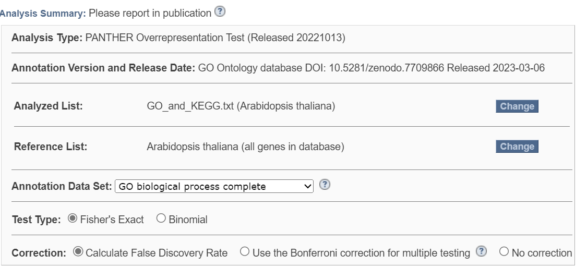
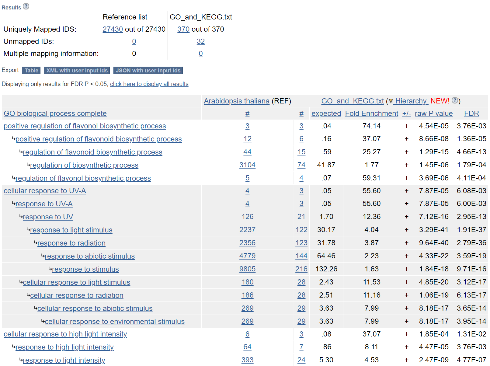

# GO
## Task 1
利用`GO_and_KEGG.R`筛选显著上调的(FDR<0.05, logFC>1)的基因，得到`GO_and_KEGG.txt`进行GO分析

流程及结果如下：

## Task 2
- fold enrichment的计算
$$fold\ enrichment=\frac{GeneRatio}{BgRatio}$$
    - GeneRatio是一个分数，分子是富集到这个GO条目上的基因的数目，分母是所有输入的做富集分析的基因的数目，可以是差异表达分析得到的基因；

    - BgRatio即Background Ratio，也是一个分数，分母是参考基因组中所有编码蛋白的基因中有GO注释的基因的数目，分子是基因中注释到这个GO条目上面的基因的数目
- p-value的计算
计算基于超几何分布
$$p\ value=\frac{\binom{n}{k}\binom{N-n}{K-k}}{\binom{N}{K}}$$
    - N是参考基因组中所有编码蛋白的基因中有GO注释的基因的数目
    - K是参考基因组中在这个GO条目上面有注释的基因的数目
    - n是输入的做富集分析的基因的数目
    - k是输入的做富集分析的基因中注释到这个GO条目上面的基因的数目

- 使用FDR的原因

    - 校正后的p值（qvalue=padj=FDR=Corrected p-Value=p-adjusted），是对p值进行了多重假设检验，能更好地控制假阳性率。