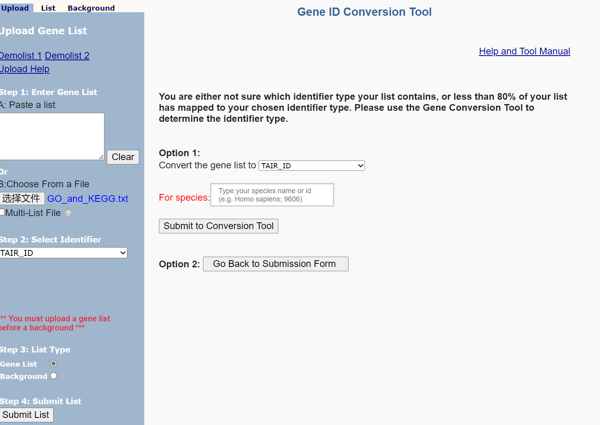
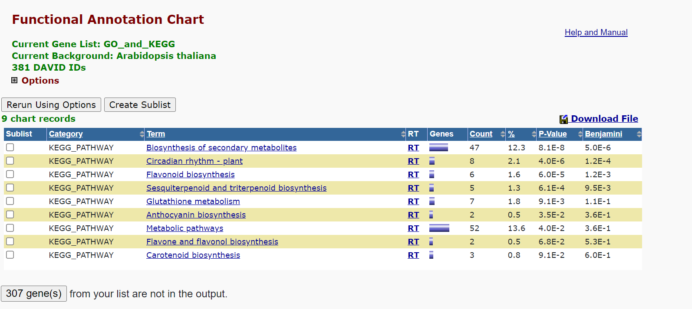

# KEGG
## Task 1
利用`GO_and_KEGG.R`筛选显著上调的(FDR<0.05, logFC>1)的基因，得到`GO_and_KEGG.txt`进行KEGG分析

流程及结果如下：

区别与联系如下：
1. GO数据库的基础就是一个一个的GO term，它们是树状的结构，存在冗余。GO database的root node有三个，分别为BP、CC、MF。KEGG就是人工注释的一张又一张代谢通路，是网状的。
2. GO term是一个纯粹的基因集，没有定义里面基因的相互关系；KEGG不仅有基因集，还定义了基因和代谢物之间的复杂的相互关系，所以才能叫做pathway。
3. 论相似性，从纯基因集的角度，GO的BP和KEGG有较高的相似性。
4. GO分析是基于序列信息的，而KEGG分析是基于表达信息的。这意味着GO分析可以在基因还没有被表达的情况下就可以确定其功能，而KEGG分析则必须等到基因被表达出来之后才能进行分析。
5. GO分析更加侧重于单个基因的功能，而KEGG分析则侧重于生物体系统中基因之间的相互作用。